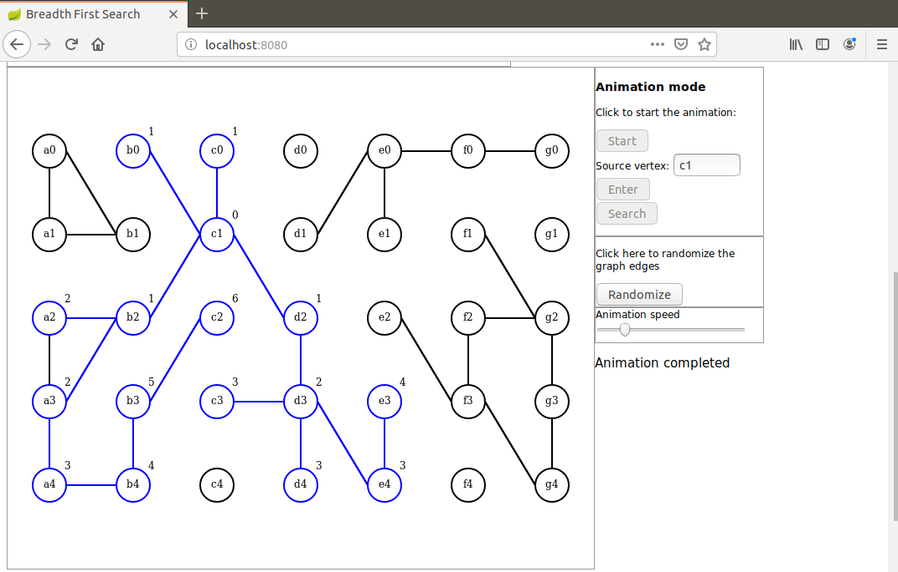

# breadth-first-search-anim
I present here a Java based demonstration of the Breadth First Search Algorithm. The algorithm itself is implemented in Java on server side. Javascript is used for display and graph initialization only.

A recent Maven version is needed to run this demo (I used 3.6.0).

The unoriented graph edges are randomly initialized.

A single search request is sent to the server that responds with a collection of all intermediate search results as a JSON object.

Then the results collection is used in the animation.

To launch the application run this command in project directory: `mvn spring-boot:run`

When the application has started hit the browser on url: `localhost:8080/breadth-first-search`

Here is the screen shot of the final step showing a component:

For a step-by-step demonstration of BFS algorithm please visit this repository:

https://github.com/dubersfeld/breadth-first-search-step
 

Dominique Ubersfeld, Cachan, France
